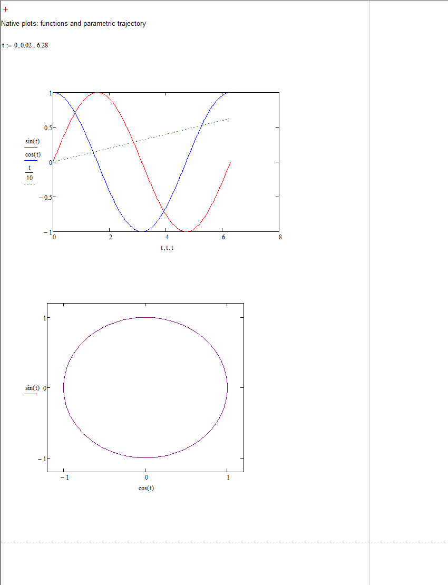
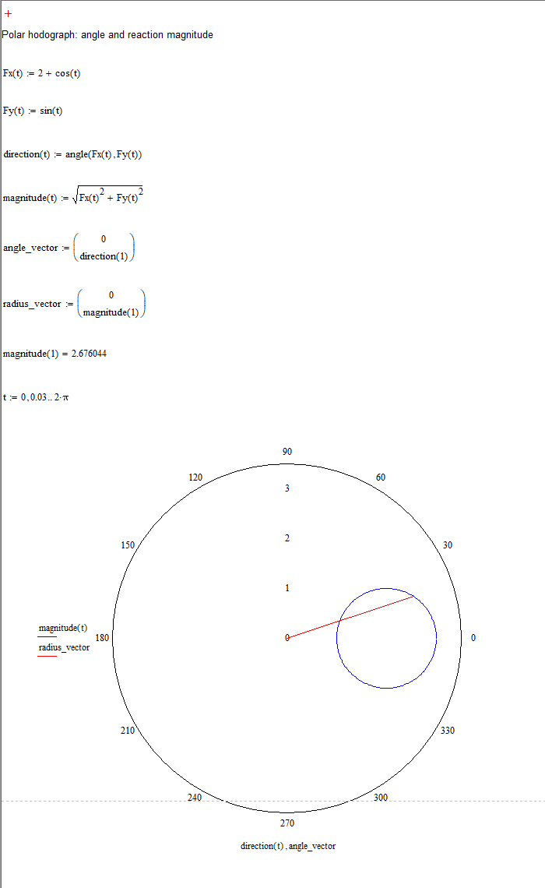
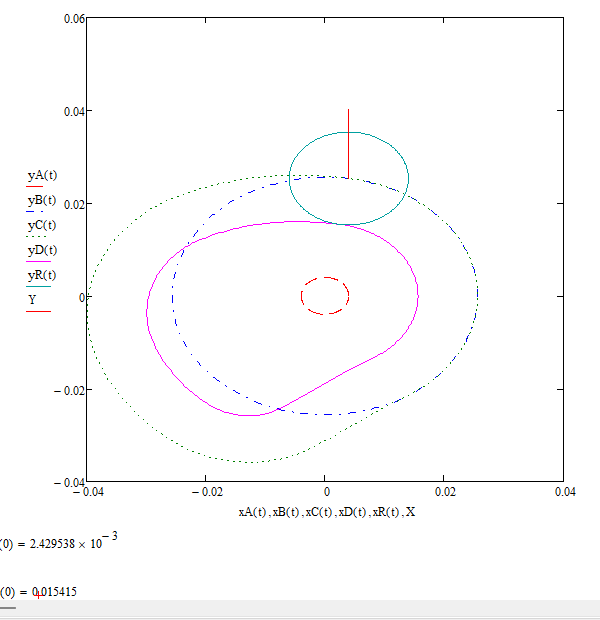
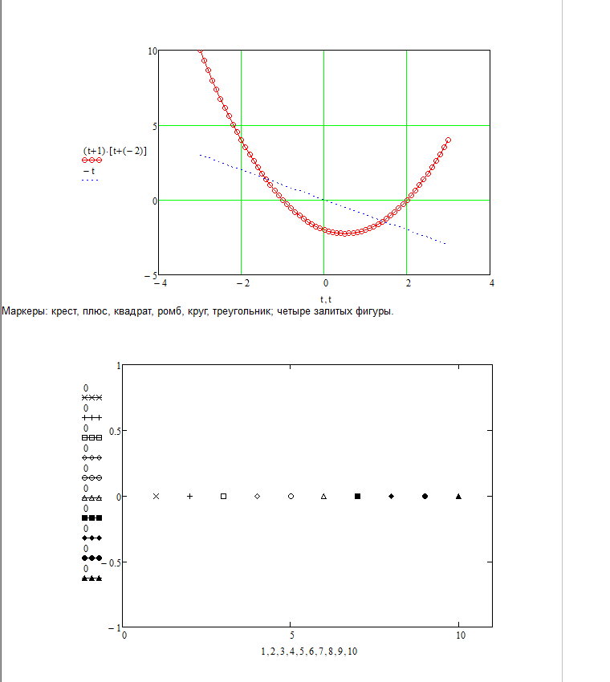

# Нативные графики

`XYPlot` сериализует редактируемый XY-график Mathcad. Трасса `Trace(x, y)` связывает две координаты: векторы, диапазоны или вызовы функций. Параметрическая траектория и годограф задаются тем же способом, например `Trace(B.COS(t), B.SIN(t))`.

```python
from xmcd import Worksheet, Symbol, Range, Trace, BuiltinFunction as B

t = Symbol("t")
sheet = Worksheet()
sheet.define(t, Range(0, 6.28, second=0.02))
sheet.plot(Trace(t, B.SIN(t), color="#ff0000"),
           Trace(t, B.COS(t), color="#0000ff"),
           width=360, height=240)
sheet.write("curves.xmcd")
```

`x_bounds` и `y_bounds` принимают `(минимум, максимум)`; `None` включает автоматический предел. Стили трасс задаёт `LineStyle`: `SOLID`, `DASH`, `DOT`, `DASH_DOT`. `marker` принимает `Marker`: `NONE`, `CROSS`, `PLUS`, `SQUARE`, `DIAMOND`, `CIRCLE`, `TRIANGLE` и залитые варианты `FILLED_SQUARE`, `FILLED_DIAMOND`, `FILLED_CIRCLE`, `FILLED_TRIANGLE`. `x_grid=True` и `y_grid=True` включают сетку. Цвет — `#RRGGBB`. Размер округляется к внутренней сетке Mathcad; окончательная ширина зависит также от подписей осей.

## Диапазон данных и границы осей

`Range` определяет точки, в которых Mathcad вычисляет выражения трассы. `x_bounds` задаёт видимую область графика. Автоматическая ось может округлять предел наружу: для данных `0 … 2π` она доходит до 8, а кривая заканчивается около 6.28. Это проверено на небольшом нативном примере с синусом и косинусом. Для показа ровно одного оборота используйте `x_bounds=(0, math.tau)` и диапазон до `math.tau`. Изменение границ оси не добавляет точки и не продолжает данные за их диапазон.

Шаг диапазона влияет на подробность кривой и объём пересчёта: `math.tau / 72` соответствует 5°, `math.tau / 360` — 1°. Для параметрического графика диапазон относится к параметру, а границы X/Y — к координатам траектории; их задают независимо.

## Устройство

`_plot_binary.py` собирает архив из описаний классов, дерева выражений и настроек. Полный документ или график-шаблон не загружается. Число трасс определяет дерево разделённых запятыми выражений, независимо от оформления. В настройках классического графика имеется 16 слотов трасс.

Формат получен сравнением собственных пустого графика, графика векторов и изменённого через UI графика. Выражения содержат ссылку на родителя, левое и правое поддерево и UTF-16 строку. Размеры внутренней области хранятся отдельно от XML-координат региона. Коды скобок вызова и деления дополнительно сверены с локальным нативным образцом старой библиотеки; её код и готовые графики не используются при генерации.

## Проверка и текущие ограничения

`examples/plots.py` пересчитан в Mathcad 14.1.5.594. Проверены три трассы `sin(t)`, `cos(t)`, `t/10`, параметрическая окружность, цвета, штриховая линия и явные пределы. Сохранённый документ: `tests/fixtures/plots-mathcad14.xmcd`.



Внутри графика поддержаны идентификаторы, числа, вызовы функций, скобки, сложение, вычитание, умножение, отрицание, степени и деление. В бинарном дереве графика вычитание записывается как сумма с отрицанием; обычные математические регионы используют оператор вычитания. Для остальных выражений пока определяйте функцию или вектор обычным математическим регионом. Логарифмические оси, заголовки и 3D-графики требуют дальнейшей реализации и проверки. Это ограничения текущей реализации, а не модели выражений XML.

## Полярные годографы

`PolarPlot` и `sheet.polar_plot(...)` принимают `Trace(угол, радиус)`. Углы задаются в радианах; `y_bounds` ограничивает радиальную ось. Можно сочетать функциональную кривую и вектор выбранного состояния. `examples/hodograph.py` прошёл пересчёт и сохранение в Mathcad; результат — `tests/fixtures/hodograph-mathcad14.xmcd`.



## Профиль кулачка и размер дерева

`examples/cam.py` связывает интерполяцию ускорений, два интегрирования, нормировку хода, Given–Find, фазовый портрет и профиль с шестью трассами. Все шесть графиков документа прочитаны и сохранены Mathcad.



Ссылки на объекты и длины строк используют целые переменной длины: 0–63 занимают один байт; начиная с 64 старшие два бита задают число дополнительных байтов. Временные ограничения размера дерева и строк сняты. Сама вычислительная система Mathcad ограничивает длину идентификаторов: имя длиной 70 символов принимается, имя из 260 символов возвращает «Слишком длинное имя», хотя бинарный график сохраняется.

`examples/graph_stress.py` проверяет имя функции длиной 70 символов и восемь трасс с вложенными вызовами, более 300 узлов в архиве. `examples/plot_expressions.py` проверяет составную параболу, отрицание и десять видов маркеров. Оба примера пересчитаны и сохранены в `tests/fixtures/` без ошибок.


